# Internal dependency graph

_Generated 2026-07-14 by `scripts/depgraph.py` — 71 modules, 181 internal import edges (160 runtime, 21 type-annotation-only). Regenerate with `make graph`._

Nodes are modules under `sovereign`, grouped by top-level package. Only imports internal to the package are shown. Solid arrows (`-->`) are runtime imports; dashed arrows (`-.->`) are type-annotation-only imports (`if TYPE_CHECKING:` blocks). Type-only edges are excluded from cycle detection and fan-in/fan-out. Modules that participate in a runtime import cycle are outlined in red.

```mermaid
graph LR
  subgraph bench
    n_sovereign_bench_cells["bench/cells.py"]
    n_sovereign_bench_cleanroom["bench/cleanroom.py"]
    n_sovereign_bench_cli["bench/cli.py"]
    n_sovereign_bench_grading["bench/grading.py"]
    n_sovereign_bench_lock["bench/lock.py"]
    n_sovereign_bench_perf["bench/perf.py"]
    n_sovereign_bench_quality["bench/quality.py"]
    n_sovereign_bench_report["bench/report.py"]
    n_sovereign_bench_runner["bench/runner.py"]
    n_sovereign_bench_spec["bench/spec.py"]
    n_sovereign_bench_suites["bench/suites.py"]
  end
  subgraph cli
    n_sovereign_cli__common["cli/_common.py"]
    n_sovereign_cli_harness["cli/harness.py"]
    n_sovereign_cli_logging_config["cli/logging_config.py"]
    n_sovereign_cli_models["cli/models.py"]
    n_sovereign_cli_stack["cli/stack.py"]
  end
  subgraph core
    n_sovereign_core_base_config["core/base_config.py"]
    n_sovereign_core_base_harness["core/base_harness.py"]
    n_sovereign_core_base_manager["core/base_manager.py"]
    n_sovereign_core_errors["core/errors.py"]
    n_sovereign_core_planning["core/planning.py"]
    n_sovereign_core_procmem["core/procmem.py"]
    n_sovereign_core_provisioning["core/provisioning.py"]
    n_sovereign_core_registry["core/registry.py"]
    n_sovereign_core_resolver["core/resolver.py"]
    n_sovereign_core_resources["core/resources.py"]
    n_sovereign_core_state["core/state.py"]
    n_sovereign_core_units["core/units.py"]
  end
  subgraph harnesses
    n_sovereign_harnesses_cline_cli["harnesses/cline_cli/__init__.py"]
    n_sovereign_harnesses_cline_cli_config["harnesses/cline_cli/config.py"]
    n_sovereign_harnesses_cline_cli_manager["harnesses/cline_cli/manager.py"]
    n_sovereign_harnesses_mini_swe_agent["harnesses/mini_swe_agent/__init__.py"]
    n_sovereign_harnesses_mini_swe_agent_config["harnesses/mini_swe_agent/config.py"]
    n_sovereign_harnesses_mini_swe_agent_manager["harnesses/mini_swe_agent/manager.py"]
    n_sovereign_harnesses_opencode["harnesses/opencode/__init__.py"]
    n_sovereign_harnesses_opencode_config["harnesses/opencode/config.py"]
    n_sovereign_harnesses_opencode_manager["harnesses/opencode/manager.py"]
  end
  subgraph runtime
    n_sovereign_runtime_dashboard["runtime/dashboard.py"]
    n_sovereign_runtime_manifest["runtime/manifest.py"]
    n_sovereign_runtime_orchestrator["runtime/orchestrator.py"]
    n_sovereign_runtime_status["runtime/status.py"]
    n_sovereign_runtime_teardown["runtime/teardown.py"]
    n_sovereign_runtime_telemetry["runtime/telemetry.py"]
  end
  subgraph services
    n_sovereign_services_docker["services/docker/__init__.py"]
    n_sovereign_services_docker_config["services/docker/config.py"]
    n_sovereign_services_docker_manager["services/docker/manager.py"]
    n_sovereign_services_inference["services/inference/__init__.py"]
    n_sovereign_services_inference_base["services/inference/base.py"]
    n_sovereign_services_inference_hf["services/inference/hf.py"]
    n_sovereign_services_inference_llama_cpp["services/inference/llama_cpp/__init__.py"]
    n_sovereign_services_inference_llama_cpp_config["services/inference/llama_cpp/config.py"]
    n_sovereign_services_inference_llama_cpp_manager["services/inference/llama_cpp/manager.py"]
    n_sovereign_services_inference_mlx_lm["services/inference/mlx_lm/__init__.py"]
    n_sovereign_services_inference_mlx_lm_config["services/inference/mlx_lm/config.py"]
    n_sovereign_services_inference_mlx_lm_manager["services/inference/mlx_lm/manager.py"]
    n_sovereign_services_inference_routing["services/inference/routing.py"]
  end
  subgraph top-level
    n_sovereign["__init__.py"]
    n_sovereign_bench["bench/__init__.py"]
    n_sovereign_cli["cli/__init__.py"]
    n_sovereign_config["config.py"]
    n_sovereign_core["core/__init__.py"]
    n_sovereign_harnesses["harnesses/__init__.py"]
    n_sovereign_runtime["runtime/__init__.py"]
    n_sovereign_services["services/__init__.py"]
    n_sovereign_workers["workers/__init__.py"]
  end
  subgraph workers
    n_sovereign_workers_engine_worker["workers/engine_worker.py"]
    n_sovereign_workers_llama_cpp_adapter["workers/llama_cpp_adapter.py"]
    n_sovereign_workers_mlx_lm_adapter["workers/mlx_lm_adapter.py"]
    n_sovereign_workers_protocol["workers/protocol.py"]
    n_sovereign_workers_telemetry["workers/telemetry.py"]
    n_sovereign_workers_worker_config["workers/worker_config.py"]
  end
  n_sovereign_bench_cells --> n_sovereign_core_state
  n_sovereign_bench_cleanroom --> n_sovereign_bench_perf
  n_sovereign_bench_cleanroom --> n_sovereign_bench_quality
  n_sovereign_bench_cleanroom --> n_sovereign_bench_runner
  n_sovereign_bench_cleanroom --> n_sovereign_config
  n_sovereign_bench_cleanroom --> n_sovereign_core_resources
  n_sovereign_bench_cleanroom --> n_sovereign_core_units
  n_sovereign_bench_cleanroom --> n_sovereign_runtime_orchestrator
  n_sovereign_bench_cli --> n_sovereign_bench_cleanroom
  n_sovereign_bench_cli --> n_sovereign_bench_lock
  n_sovereign_bench_cli --> n_sovereign_bench_perf
  n_sovereign_bench_cli --> n_sovereign_bench_quality
  n_sovereign_bench_cli --> n_sovereign_bench_report
  n_sovereign_bench_cli --> n_sovereign_bench_runner
  n_sovereign_bench_cli --> n_sovereign_bench_spec
  n_sovereign_bench_cli --> n_sovereign_cli__common
  n_sovereign_bench_cli --> n_sovereign_core_state
  n_sovereign_bench_grading --> n_sovereign_bench_suites
  n_sovereign_bench_lock --> n_sovereign_core_state
  n_sovereign_bench_perf --> n_sovereign_bench_spec
  n_sovereign_bench_perf --> n_sovereign_core_state
  n_sovereign_bench_perf --> n_sovereign_core_units
  n_sovereign_bench_quality --> n_sovereign_bench_cells
  n_sovereign_bench_quality --> n_sovereign_bench_grading
  n_sovereign_bench_quality --> n_sovereign_bench_runner
  n_sovereign_bench_quality --> n_sovereign_bench_suites
  n_sovereign_bench_quality --> n_sovereign_config
  n_sovereign_bench_quality --> n_sovereign_core_base_harness
  n_sovereign_bench_quality --> n_sovereign_core_registry
  n_sovereign_bench_quality --> n_sovereign_core_resolver
  n_sovereign_bench_quality --> n_sovereign_core_state
  n_sovereign_bench_report --> n_sovereign_core_state
  n_sovereign_bench_runner --> n_sovereign_bench_cells
  n_sovereign_bench_runner --> n_sovereign_bench_lock
  n_sovereign_bench_runner --> n_sovereign_bench_spec
  n_sovereign_bench_runner --> n_sovereign_core_state
  n_sovereign_bench_spec --> n_sovereign_core_base_config
  n_sovereign_bench_suites --> n_sovereign_core_base_config
  n_sovereign_cli --> n_sovereign_bench_cli
  n_sovereign_cli --> n_sovereign_cli__common
  n_sovereign_cli --> n_sovereign_cli_harness
  n_sovereign_cli --> n_sovereign_cli_logging_config
  n_sovereign_cli --> n_sovereign_cli_models
  n_sovereign_cli --> n_sovereign_cli_stack
  n_sovereign_cli__common --> n_sovereign_config
  n_sovereign_cli__common --> n_sovereign_core_provisioning
  n_sovereign_cli__common --> n_sovereign_core_registry
  n_sovereign_cli__common --> n_sovereign_core_resolver
  n_sovereign_cli__common --> n_sovereign_core_state
  n_sovereign_cli__common --> n_sovereign_runtime_dashboard
  n_sovereign_cli_harness --> n_sovereign_cli__common
  n_sovereign_cli_harness --> n_sovereign_core_base_harness
  n_sovereign_cli_models --> n_sovereign_cli__common
  n_sovereign_cli_models --> n_sovereign_core_units
  n_sovereign_cli_stack --> n_sovereign
  n_sovereign_cli_stack --> n_sovereign_bench_lock
  n_sovereign_cli_stack --> n_sovereign_cli__common
  n_sovereign_cli_stack --> n_sovereign_core_base_manager
  n_sovereign_cli_stack --> n_sovereign_core_errors
  n_sovereign_cli_stack --> n_sovereign_core_planning
  n_sovereign_cli_stack --> n_sovereign_core_provisioning
  n_sovereign_cli_stack --> n_sovereign_core_registry
  n_sovereign_cli_stack --> n_sovereign_core_resolver
  n_sovereign_cli_stack --> n_sovereign_core_state
  n_sovereign_cli_stack --> n_sovereign_core_units
  n_sovereign_cli_stack --> n_sovereign_runtime_dashboard
  n_sovereign_cli_stack --> n_sovereign_runtime_orchestrator
  n_sovereign_cli_stack --> n_sovereign_runtime_teardown
  n_sovereign_config --> n_sovereign_core_base_config
  n_sovereign_core_base_config --> n_sovereign_core_units
  n_sovereign_core_base_harness --> n_sovereign_core_provisioning
  n_sovereign_core_base_harness --> n_sovereign_core_resolver
  n_sovereign_core_planning --> n_sovereign_config
  n_sovereign_core_planning --> n_sovereign_core_errors
  n_sovereign_core_planning --> n_sovereign_core_registry
  n_sovereign_core_planning --> n_sovereign_core_resources
  n_sovereign_core_registry --> n_sovereign_core_base_harness
  n_sovereign_core_registry --> n_sovereign_core_base_manager
  n_sovereign_core_registry --> n_sovereign_harnesses
  n_sovereign_core_registry --> n_sovereign_services
  n_sovereign_core_resources --> n_sovereign_config
  n_sovereign_core_resources --> n_sovereign_core_base_manager
  n_sovereign_core_resources --> n_sovereign_core_units
  n_sovereign_harnesses_cline_cli --> n_sovereign_harnesses_cline_cli_manager
  n_sovereign_harnesses_cline_cli_config --> n_sovereign_core_base_config
  n_sovereign_harnesses_cline_cli_manager --> n_sovereign_core_base_harness
  n_sovereign_harnesses_cline_cli_manager --> n_sovereign_core_registry
  n_sovereign_harnesses_cline_cli_manager --> n_sovereign_harnesses_cline_cli_config
  n_sovereign_harnesses_mini_swe_agent --> n_sovereign_harnesses_mini_swe_agent_manager
  n_sovereign_harnesses_mini_swe_agent_config --> n_sovereign_core_base_config
  n_sovereign_harnesses_mini_swe_agent_manager --> n_sovereign_core_base_harness
  n_sovereign_harnesses_mini_swe_agent_manager --> n_sovereign_core_registry
  n_sovereign_harnesses_mini_swe_agent_manager --> n_sovereign_harnesses_mini_swe_agent_config
  n_sovereign_harnesses_opencode --> n_sovereign_harnesses_opencode_manager
  n_sovereign_harnesses_opencode_config --> n_sovereign_core_base_config
  n_sovereign_harnesses_opencode_manager --> n_sovereign_core_base_harness
  n_sovereign_harnesses_opencode_manager --> n_sovereign_core_registry
  n_sovereign_harnesses_opencode_manager --> n_sovereign_harnesses_opencode_config
  n_sovereign_runtime_dashboard --> n_sovereign
  n_sovereign_runtime_dashboard --> n_sovereign_core_state
  n_sovereign_runtime_dashboard --> n_sovereign_core_units
  n_sovereign_runtime_manifest --> n_sovereign_core_base_harness
  n_sovereign_runtime_manifest --> n_sovereign_core_base_manager
  n_sovereign_runtime_manifest --> n_sovereign_core_state
  n_sovereign_runtime_orchestrator --> n_sovereign_config
  n_sovereign_runtime_orchestrator --> n_sovereign_core_base_harness
  n_sovereign_runtime_orchestrator --> n_sovereign_core_base_manager
  n_sovereign_runtime_orchestrator --> n_sovereign_core_registry
  n_sovereign_runtime_orchestrator --> n_sovereign_core_resolver
  n_sovereign_runtime_orchestrator --> n_sovereign_core_resources
  n_sovereign_runtime_orchestrator --> n_sovereign_core_state
  n_sovereign_runtime_orchestrator --> n_sovereign_core_units
  n_sovereign_runtime_orchestrator --> n_sovereign_runtime_manifest
  n_sovereign_runtime_orchestrator --> n_sovereign_runtime_status
  n_sovereign_runtime_orchestrator --> n_sovereign_runtime_telemetry
  n_sovereign_runtime_orchestrator --> n_sovereign_services_docker_manager
  n_sovereign_runtime_orchestrator --> n_sovereign_workers_protocol
  n_sovereign_runtime_telemetry --> n_sovereign_services_docker_manager
  n_sovereign_runtime_telemetry --> n_sovereign_workers_protocol
  n_sovereign_services_docker --> n_sovereign_services_docker_manager
  n_sovereign_services_docker_config --> n_sovereign_core_base_config
  n_sovereign_services_docker_manager --> n_sovereign_config
  n_sovereign_services_docker_manager --> n_sovereign_core_base_manager
  n_sovereign_services_docker_manager --> n_sovereign_core_provisioning
  n_sovereign_services_docker_manager --> n_sovereign_core_registry
  n_sovereign_services_docker_manager --> n_sovereign_core_resolver
  n_sovereign_services_docker_manager --> n_sovereign_services_docker_config
  n_sovereign_services_inference_base --> n_sovereign_config
  n_sovereign_services_inference_base --> n_sovereign_core_base_config
  n_sovereign_services_inference_base --> n_sovereign_core_base_manager
  n_sovereign_services_inference_base --> n_sovereign_core_procmem
  n_sovereign_services_inference_base --> n_sovereign_core_provisioning
  n_sovereign_services_inference_base --> n_sovereign_core_resolver
  n_sovereign_services_inference_base --> n_sovereign_core_resources
  n_sovereign_services_inference_base --> n_sovereign_services_inference_hf
  n_sovereign_services_inference_base --> n_sovereign_workers_worker_config
  n_sovereign_services_inference_hf --> n_sovereign_core_errors
  n_sovereign_services_inference_hf --> n_sovereign_core_state
  n_sovereign_services_inference_llama_cpp --> n_sovereign_services_inference_llama_cpp_manager
  n_sovereign_services_inference_llama_cpp_config --> n_sovereign_core_base_config
  n_sovereign_services_inference_llama_cpp_manager --> n_sovereign_config
  n_sovereign_services_inference_llama_cpp_manager --> n_sovereign_core_registry
  n_sovereign_services_inference_llama_cpp_manager --> n_sovereign_services_inference_base
  n_sovereign_services_inference_llama_cpp_manager --> n_sovereign_services_inference_llama_cpp_config
  n_sovereign_services_inference_mlx_lm --> n_sovereign_services_inference_mlx_lm_manager
  n_sovereign_services_inference_mlx_lm_config --> n_sovereign_core_base_config
  n_sovereign_services_inference_mlx_lm_manager --> n_sovereign_core_registry
  n_sovereign_services_inference_mlx_lm_manager --> n_sovereign_services_inference_base
  n_sovereign_services_inference_mlx_lm_manager --> n_sovereign_services_inference_mlx_lm_config
  n_sovereign_services_inference_routing --> n_sovereign_core_base_manager
  n_sovereign_services_inference_routing --> n_sovereign_core_errors
  n_sovereign_services_inference_routing --> n_sovereign_core_registry
  n_sovereign_services_inference_routing --> n_sovereign_services_inference_hf
  n_sovereign_workers_engine_worker --> n_sovereign_core_procmem
  n_sovereign_workers_engine_worker --> n_sovereign_workers_protocol
  n_sovereign_workers_engine_worker --> n_sovereign_workers_telemetry
  n_sovereign_workers_engine_worker --> n_sovereign_workers_worker_config
  n_sovereign_workers_llama_cpp_adapter --> n_sovereign_workers_protocol
  n_sovereign_workers_mlx_lm_adapter --> n_sovereign_workers_protocol
  n_sovereign_workers_telemetry --> n_sovereign_workers_protocol
  n_sovereign_bench_cleanroom -.-> n_sovereign_bench_spec
  n_sovereign_bench_perf -.-> n_sovereign_bench_runner
  n_sovereign_bench_quality -.-> n_sovereign_bench_spec
  n_sovereign_cli__common -.-> n_sovereign_core_base_harness
  n_sovereign_core_base_harness -.-> n_sovereign_config
  n_sovereign_core_base_manager -.-> n_sovereign_config
  n_sovereign_core_base_manager -.-> n_sovereign_core_resolver
  n_sovereign_core_base_manager -.-> n_sovereign_services_inference_hf
  n_sovereign_core_registry -.-> n_sovereign_config
  n_sovereign_harnesses_cline_cli_manager -.-> n_sovereign_config
  n_sovereign_harnesses_mini_swe_agent_manager -.-> n_sovereign_config
  n_sovereign_harnesses_opencode_manager -.-> n_sovereign_config
  n_sovereign_runtime_dashboard -.-> n_sovereign_runtime_orchestrator
  n_sovereign_runtime_manifest -.-> n_sovereign_runtime_orchestrator
  n_sovereign_services_inference_llama_cpp_manager -.-> n_sovereign_services_inference_hf
  n_sovereign_services_inference_mlx_lm_manager -.-> n_sovereign_services_inference_hf
  n_sovereign_services_inference_routing -.-> n_sovereign_config
  n_sovereign_workers_llama_cpp_adapter -.-> n_sovereign_workers_telemetry
  n_sovereign_workers_llama_cpp_adapter -.-> n_sovereign_workers_worker_config
  n_sovereign_workers_mlx_lm_adapter -.-> n_sovereign_workers_telemetry
  n_sovereign_workers_mlx_lm_adapter -.-> n_sovereign_workers_worker_config
```

## Import cycles

None detected ✅

## Coupling (fan-in / fan-out)

Sorted by total coupling (fan-in + fan-out). Counts runtime edges only. High fan-in = a hub many modules depend on; high fan-out = a module that pulls in a lot.

| Module | Fan-in | Fan-out | Total |
| --- | ---: | ---: | ---: |
| `core/registry.py` | 12 | 4 | 16 |
| `cli/stack.py` | 1 | 14 | 15 |
| `runtime/orchestrator.py` | 2 | 13 | 15 |
| `core/state.py` | 13 | 0 | 13 |
| `bench/quality.py` | 2 | 9 | 11 |
| `cli/_common.py` | 5 | 6 | 11 |
| `core/base_config.py` | 10 | 1 | 11 |
| `services/inference/base.py` | 2 | 9 | 11 |
| `bench/cli.py` | 1 | 9 | 10 |
| `config.py` | 9 | 1 | 10 |
| `core/base_harness.py` | 8 | 2 | 10 |
| `services/docker/manager.py` | 3 | 6 | 9 |
| `bench/cleanroom.py` | 1 | 7 | 8 |
| `core/base_manager.py` | 8 | 0 | 8 |
| `core/units.py` | 8 | 0 | 8 |
| `bench/runner.py` | 3 | 4 | 7 |
| `core/resolver.py` | 7 | 0 | 7 |
| `core/resources.py` | 4 | 3 | 7 |
| `cli/__init__.py` | 0 | 6 | 6 |
| `workers/protocol.py` | 6 | 0 | 6 |
| `bench/perf.py` | 2 | 3 | 5 |
| `core/planning.py` | 1 | 4 | 5 |
| `core/provisioning.py` | 5 | 0 | 5 |
| `runtime/dashboard.py` | 2 | 3 | 5 |
| `services/inference/llama_cpp/manager.py` | 1 | 4 | 5 |
| `bench/lock.py` | 3 | 1 | 4 |
| `bench/spec.py` | 3 | 1 | 4 |
| `core/errors.py` | 4 | 0 | 4 |
| `harnesses/cline_cli/manager.py` | 1 | 3 | 4 |
| `harnesses/mini_swe_agent/manager.py` | 1 | 3 | 4 |
| `harnesses/opencode/manager.py` | 1 | 3 | 4 |
| `runtime/manifest.py` | 1 | 3 | 4 |
| `services/inference/hf.py` | 2 | 2 | 4 |
| `services/inference/mlx_lm/manager.py` | 1 | 3 | 4 |
| `services/inference/routing.py` | 0 | 4 | 4 |
| `workers/engine_worker.py` | 0 | 4 | 4 |
| `bench/cells.py` | 2 | 1 | 3 |
| `bench/suites.py` | 2 | 1 | 3 |
| `cli/harness.py` | 1 | 2 | 3 |
| `cli/models.py` | 1 | 2 | 3 |
| `runtime/telemetry.py` | 1 | 2 | 3 |
| `__init__.py` | 2 | 0 | 2 |
| `bench/grading.py` | 1 | 1 | 2 |
| `bench/report.py` | 1 | 1 | 2 |
| `core/procmem.py` | 2 | 0 | 2 |
| `harnesses/cline_cli/config.py` | 1 | 1 | 2 |
| `harnesses/mini_swe_agent/config.py` | 1 | 1 | 2 |
| `harnesses/opencode/config.py` | 1 | 1 | 2 |
| `services/docker/config.py` | 1 | 1 | 2 |
| `services/inference/llama_cpp/config.py` | 1 | 1 | 2 |
| `services/inference/mlx_lm/config.py` | 1 | 1 | 2 |
| `workers/telemetry.py` | 1 | 1 | 2 |
| `workers/worker_config.py` | 2 | 0 | 2 |
| `cli/logging_config.py` | 1 | 0 | 1 |
| `harnesses/__init__.py` | 1 | 0 | 1 |
| `harnesses/cline_cli/__init__.py` | 0 | 1 | 1 |
| `harnesses/mini_swe_agent/__init__.py` | 0 | 1 | 1 |
| `harnesses/opencode/__init__.py` | 0 | 1 | 1 |
| `runtime/status.py` | 1 | 0 | 1 |
| `runtime/teardown.py` | 1 | 0 | 1 |
| `services/__init__.py` | 1 | 0 | 1 |
| `services/docker/__init__.py` | 0 | 1 | 1 |
| `services/inference/llama_cpp/__init__.py` | 0 | 1 | 1 |
| `services/inference/mlx_lm/__init__.py` | 0 | 1 | 1 |
| `workers/llama_cpp_adapter.py` | 0 | 1 | 1 |
| `workers/mlx_lm_adapter.py` | 0 | 1 | 1 |
| `bench/__init__.py` | 0 | 0 | 0 |
| `core/__init__.py` | 0 | 0 | 0 |
| `runtime/__init__.py` | 0 | 0 | 0 |
| `services/inference/__init__.py` | 0 | 0 | 0 |
| `workers/__init__.py` | 0 | 0 | 0 |

